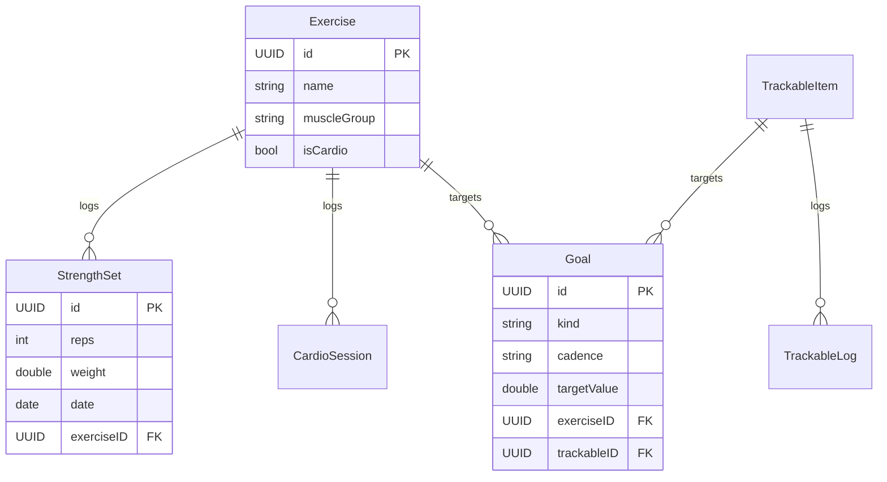

# 🏗️ Architecture Documentation

<div align="center">

**Deep dive into WorkoutTracker's architecture, design patterns, and implementation details**

[Overview](#-overview) • [Architecture](#-architecture-pattern) • [Data Models](#-data-models) • [Views](#-views-layer) • [Services](#-services-layer) • [Best Practices](#-best-practices)

</div>

---

## 📋 Table of Contents

- [Overview](#-overview)
- [Architecture Pattern](#-architecture-pattern)
- [Data Flow](#-data-flow)
- [Data Models](#-data-models)
- [Views Layer](#-views-layer)
- [Services Layer](#-services-layer)
- [Utilities](#-utilities-layer)
- [Data Relationships](#-data-relationships)
- [Query Patterns](#-query-patterns)
- [State Management](#-state-management)
- [Performance](#-performance-considerations)
- [Error Handling](#-error-handling)
- [Testing Strategy](#-testing-strategy)
- [Security & Privacy](#-security--privacy)
- [Future Enhancements](#-future-enhancements)
- [Best Practices](#-best-practices)

---

## 🎯 Overview

WorkoutTracker follows a **modern iOS architecture** using SwiftUI for the presentation layer and SwiftData for persistence. The app is structured around **feature-based modules** with clear separation of concerns.

### Core Principles

| Principle | Description |
|-----------|-------------|
| **🎯 Separation of Concerns** | Models, Views, and Business Logic are clearly separated |
| **📦 Modularity** | Feature-based organization for scalability |
| **🔄 Reactive** | SwiftUI's declarative paradigm with automatic UI updates |
| **💾 Local-First** | All data persists locally, privacy-focused design |
| **🧪 Testable** | Clean architecture enables comprehensive testing |

---

## 🏛️ Architecture Pattern

### MVVM with SwiftData

```mermaid
graph TB
    subgraph "Presentation Layer"
        A[Views<br/>SwiftUI] --> B[ViewModels<br/>Optional]
    end

    subgraph "Data Layer"
        C[SwiftData Models<br/>@Model macro]
        D[(SwiftData Store<br/>SQLite)]
    end

    subgraph "Business Logic"
        E[Services<br/>ImageStore, GoalProgress]
        F[Utilities<br/>Formatters, Units]
    end

    A --> |@Query| C
    B --> |@Environment| C
    C --> D
    A --> E
    E --> C
    A --> F

    style A fill:#4A90E2
    style C fill:#7ED321
    style D fill:#F5A623
    style E fill:#BD10E0
```

### Layer Responsibilities

<table>
<tr>
<td width="25%">

#### 🎨 Views
- User interface
- User interactions
- SwiftUI components
- Navigation

</td>
<td width="25%">

#### 🧠 ViewModels
- Complex business logic
- State management
- Data transformation
- Optional (most views use direct @Query)

</td>
<td width="25%">

#### 💾 Models
- Data structures
- SwiftData persistence
- Relationships
- Validation rules

</td>
<td width="25%">

#### ⚙️ Services
- Shared logic
- Image handling
- Goal calculations
- External interactions

</td>
</tr>
</table>

---

## 🔄 Data Flow

### Read Operations Flow

```
┌─────────┐     ┌──────────┐     ┌───────────┐     ┌─────────────┐     ┌──────────┐
│  User   │ --> │   View   │ --> │  @Query   │ --> │  SwiftData  │ --> │ UI Update│
│ Action  │     │          │     │ Descriptor│     │   Fetch     │     │ (Auto)   │
└─────────┘     └──────────┘     └───────────┘     └─────────────┘     └──────────┘
```

### Write Operations Flow

```
┌─────────┐     ┌──────────┐     ┌─────────────┐     ┌──────────┐     ┌────────────┐
│  User   │ --> │   View   │ --> │ ModelContext│ --> │ SwiftData│ --> │  Persist   │
│  Input  │     │  Action  │     │   insert/   │     │   Save   │     │ (Automatic)│
│         │     │          │     │   delete    │     │          │     │            │
└─────────┘     └──────────┘     └─────────────┘     └──────────┘     └────────────┘
                                                            │
                                                            v
                                                      ┌──────────┐
                                                      │ @Query   │
                                                      │ Updates  │
                                                      │  Views   │
                                                      └──────────┘
```

### Complex Query Flow (with ViewModel)

```
View --> ViewModel --> FetchDescriptor --> SwiftData --> Process Data --> View State --> UI
```

---

## 💾 Data Models

### Model Overview

| Model | Purpose | Key Properties | Relationships |
|-------|---------|----------------|---------------|
| **Exercise** | Exercise templates | name, muscleGroup, isCardio | → StrengthSet, CardioSession, Goal |
| **StrengthSet** | Strength workout logs | reps, weight, date | ← Exercise |
| **CardioSession** | Cardio workout logs | duration, distance, date | ← Exercise |
| **Goal** | User fitness goals | kind, cadence, targetValue | ← Exercise, TrackableItem |
| **JournalEntry** | Daily journal | date, text, photoUUIDs | Independent |
| **WeightEntry** | Body weight logs | weight, date | Independent |
| **TrackableItem** | Custom metrics | name, unit, icon | → TrackableLog, Goal |
| **TrackableLog** | Custom metric logs | value, date | ← TrackableItem |

### Model Details

<details>
<summary><strong>📊 Exercise Model</strong></summary>

```swift
@Model
final class Exercise {
    @Attribute(.unique) var id: UUID
    var name: String              // e.g., "Bench Press"
    var muscleGroup: String       // e.g., "Chest"
    var isCardio: Bool           // Distinguishes cardio from strength
    var createdAt: Date
}
```

**Purpose:** Defines reusable exercise templates
**Used By:** StrengthSet, CardioSession, Goal
**Example:** "Squat", "Running", "Deadlift"

</details>

<details>
<summary><strong>💪 StrengthSet Model</strong></summary>

```swift
@Model
final class StrengthSet {
    @Attribute(.unique) var id: UUID
    var reps: Int                 // Number of repetitions
    var weight: Double            // Weight in kilograms (displayed with unit conversion)
    var date: Date                // When the set was performed
    var exerciseID: UUID          // References Exercise.id
}
```

**Purpose:** Logs individual strength training sets
**Storage:** Weight always stored in kg internally
**Display:** Converted to lbs if user preference set

</details>

<details>
<summary><strong>🏃 CardioSession Model</strong></summary>

```swift
@Model
final class CardioSession {
    @Attribute(.unique) var id: UUID
    var duration: Int             // Duration in seconds
    var distance: Double          // Distance in kilometers (displayed with unit conversion)
    var date: Date
    var exerciseID: UUID
}
```

**Purpose:** Logs cardio workout sessions
**Storage:** Distance always in km
**Display:** Converted to miles if user preference set

</details>

<details>
<summary><strong>🎯 Goal Model</strong></summary>

```swift
@Model
final class Goal {
    @Attribute(.unique) var id: UUID
    var title: String
    var kind: Kind                // .strength, .cardio, .trackable, .weight
    var cadence: Cadence          // .oneTime, .daily, .weekly, .monthly, .yearly
    var direction: Direction      // .increase, .decrease
    var exerciseID: UUID?         // Optional: for strength/cardio goals
    var trackableID: UUID?        // Optional: for trackable goals
    var targetValue: Double       // Numeric goal target
    var unit: String              // Display unit
    var deadline: Date?           // Optional target date
    var note: String?
    var createdAt: Date
}
```

**Key Feature:** Automatic progress calculation based on cadence
**Cadence Types:**
- **One-time:** Cumulative sum since creation
- **Daily:** Today's sum
- **Weekly:** Current week (Mon-Sun)
- **Monthly:** Current month
- **Yearly:** Current year

</details>

<details>
<summary><strong>📖 JournalEntry Model</strong></summary>

```swift
@Model
final class JournalEntry {
    @Attribute(.unique) var id: UUID
    var date: Date                // Day of entry (time stripped)
    var text: String              // Journal content
    var photoUUIDs: [UUID]        // References to stored images
}
```

**Purpose:** Daily journal with photo support
**Constraint:** One entry per day (enforced by unique date)
**Photos:** Stored separately via ImageStore

</details>

<details>
<summary><strong>⚖️ WeightEntry Model</strong></summary>

```swift
@Model
final class WeightEntry {
    @Attribute(.unique) var id: UUID
    var weight: Double            // Weight in kilograms
    var date: Date
    var note: String?
}
```

**Purpose:** Track body weight over time
**Charts:** Used in weight trend analysis

</details>

<details>
<summary><strong>📊 TrackableItem Model</strong></summary>

```swift
@Model
final class TrackableItem {
    @Attribute(.unique) var id: UUID
    var name: String              // e.g., "Water Intake"
    var unit: String              // e.g., "oz", "hours", "steps"
    var icon: String              // SF Symbol name
    var category: String?
    var createdAt: Date
}
```

**Purpose:** Define custom metrics to track
**Examples:** Water (oz), Sleep (hours), Steps (count)

</details>

<details>
<summary><strong>📈 TrackableLog Model</strong></summary>

```swift
@Model
final class TrackableLog {
    @Attribute(.unique) var id: UUID
    var value: Double             // Numeric value logged
    var date: Date
    var trackableID: UUID         // References TrackableItem.id
    var note: String?
}
```

**Purpose:** Individual logs for custom trackables
**Used By:** Goal progress calculations

</details>

---

## 🎨 Views Layer

### Navigation Hierarchy

```
RootTabView (Custom Tab Bar Implementation)
│
├─ 🏋️ Track Tab
│  ├─ TrackView (Main screen)
│  ├─ AddTrackingSheet (Modal: Choose type)
│  ├─ AddSetSheet (Strength form)
│  ├─ AddCardioSheet (Cardio form)
│  ├─ LogTrackableEntrySheet (Custom trackable form)
│  └─ EditSetSheet / EditCardioSheet
│
├─ 🏆 PRs Tab
│  └─ PRsView (List of personal records)
│
├─ 🎯 Goals Tab
│  ├─ GoalsView (Goals list with progress)
│  └─ GoalEditorView (Create/Edit goal form)
│
├─ 📊 Analyze Tab
│  ├─ AnalyzeView (Main analytics screen)
│  ├─ ExerciseAnalyzeSection (Exercise-specific charts)
│  │  ├─ Volume over time chart
│  │  ├─ Rep distribution chart
│  │  └─ Weight progression chart
│  └─ WeightAnalyzeSection (Body weight trends)
│
└─ 📖 Journal Tab
   └─ JournalView (Daily journal with photos)
```

### Custom Tab Bar Deep Dive

**Why Custom?**
iOS's native `TabView` supports only 5 tabs before introducing a "More" menu. WorkoutTracker needs exactly 5 tabs always visible.

**Implementation Strategy:**

```swift
struct RootTabView: View {
    @State private var selection: Tab = .track

    var body: some View {
        VStack(spacing: 0) {
            // Content area
            ZStack {
                switch selection {
                case .track: NavigationStack { TrackView() }
                case .prs: NavigationStack { PRsView() }
                case .goals: NavigationStack { GoalsView() }
                case .analyze: NavigationStack { AnalyzeView() }
                case .journal: NavigationStack { JournalView() }
                }
            }

            Divider()

            // Custom tab bar
            HStack {
                ForEach(Tab.allCases) { tab in
                    Button { selection = tab } label: {
                        VStack(spacing: 4) {
                            Image(systemName: tab.systemImage)
                            Text(tab.title).font(.caption2)
                        }
                        .foregroundStyle(selection == tab ? .accentColor : .secondary)
                    }
                    .frame(maxWidth: .infinity)
                }
            }
            .padding()
            .background(.ultraThinMaterial)
        }
    }
}
```

**Benefits:**
- ✅ All 5 tabs always visible
- ✅ Custom styling and animations
- ✅ No "More" tab overflow
- ✅ Full control over appearance

### View Components

<table>
<tr>
<th>Category</th>
<th>Components</th>
<th>Purpose</th>
</tr>
<tr>
<td><strong>Shared</strong></td>
<td>
<code>SummaryCard</code><br>
<code>TrackFilterSheet</code><br>
<code>DayPickerSheet</code>
</td>
<td>Reusable UI components used across features</td>
</tr>
<tr>
<td><strong>Forms</strong></td>
<td>
<code>AddSetSheet</code><br>
<code>AddCardioSheet</code><br>
<code>GoalEditorView</code>
</td>
<td>Data entry forms with validation</td>
</tr>
<tr>
<td><strong>Lists</strong></td>
<td>
<code>TrackView</code><br>
<code>PRsView</code><br>
<code>GoalsView</code>
</td>
<td>Display collections with SwiftUI List</td>
</tr>
<tr>
<td><strong>Charts</strong></td>
<td>
<code>ExerciseAnalyzeSection</code><br>
<code>WeightAnalyzeSection</code>
</td>
<td>Data visualization using Swift Charts</td>
</tr>
</table>

---

## ⚙️ Services Layer

### ImageStore Service

**Purpose:** Manage journal photo persistence

```swift
final class ImageStore {
    func save(imageData: Data) async -> UUID?
    func load(uuid: UUID) async -> UIImage?
    func delete(uuid: UUID) async throws
}
```

**Storage Location:** `FileManager.documentDirectory/images/{uuid}.jpg`
**Format:** JPEG with 0.8 compression
**Max Size:** 1024px (longest dimension)

**Flow:**
```
User selects photo → ImageStore.save() → UUID returned → Store in JournalEntry.photoUUIDs
Display needed → ImageStore.load(uuid) → UIImage → Show in view
```

### GoalProgressService

**Purpose:** Calculate goal progress based on cadence

```swift
final class GoalProgressService {
    static func calculateProgress(
        goal: Goal,
        context: ModelContext
    ) -> (current: Double, target: Double, percentage: Double)
}
```

**Calculation Logic by Cadence:**

| Cadence | Time Window | Calculation |
|---------|------------|-------------|
| **One-time** | Since goal creation | Sum all matching entries after `createdAt` |
| **Daily** | Today (00:00 - 23:59) | Sum entries where `date.dayOnly == today.dayOnly` |
| **Weekly** | Mon-Sun current week | Sum entries in `Calendar.current.dateInterval(of: .weekOfYear)` |
| **Monthly** | Current calendar month | Sum entries where `date.month == currentMonth` |
| **Yearly** | Current calendar year | Sum entries where `date.year == currentYear` |

**Example Query (Daily Strength Goal):**
```swift
let startOfDay = Calendar.current.startOfDay(for: Date())
let endOfDay = Calendar.current.date(byAdding: .day, value: 1, to: startOfDay)!

let descriptor = FetchDescriptor<StrengthSet>(
    predicate: #Predicate { set in
        set.exerciseID == goal.exerciseID &&
        set.date >= startOfDay &&
        set.date < endOfDay
    }
)
let sets = try? context.fetch(descriptor)
let volume = sets?.reduce(0) { $0 + Double($1.reps) * $1.weight } ?? 0
```

---

## 🔧 Utilities Layer

### Date+Only Extension

**Purpose:** Strip time component for day-based queries

```swift
extension Date {
    var dayOnly: Date {
        Calendar.current.startOfDay(for: self)
    }
}
```

**Usage:**
```swift
// Compare dates without time
if entry.date.dayOnly == selectedDate.dayOnly {
    // Same day
}
```

### Units Utility

**Purpose:** Unit conversion and formatting

| Function | Input | Output | Description |
|----------|-------|--------|-------------|
| `kgToPounds(_ kg: Double)` | kg | lbs | kg × 2.20462 |
| `poundsToKg(_ lbs: Double)` | lbs | kg | lbs ÷ 2.20462 |
| `kmToMiles(_ km: Double)` | km | mi | km × 0.621371 |
| `milesToKm(_ mi: Double)` | mi | km | mi ÷ 0.621371 |
| `formatWeight(_ kg:, usePounds:)` | kg, Bool | String | "135 lbs" or "61.2 kg" |
| `formatDistance(_ km:, useMiles:)` | km, Bool | String | "3.1 mi" or "5.0 km" |

**Storage Strategy:**
All values stored in metric (kg, km), converted for display only.

### Formatters

**Shared Number Formatter:**
```swift
static let numberFormatter: NumberFormatter = {
    let formatter = NumberFormatter()
    formatter.minimumFractionDigits = 0
    formatter.maximumFractionDigits = 1
    return formatter
}()
```

**Date Formatters:**
```swift
static let dateFormatter: DateFormatter // "Jan 15, 2024"
static let timeFormatter: DateFormatter // "2:35:12 PM"
```

### TrackableCatalog

**Predefined Trackables:**

| Name | Unit | Icon | Category |
|------|------|------|----------|
| Water Intake | oz | drop.fill | Nutrition |
| Sleep | hours | bed.double.fill | Health |
| Steps | count | figure.walk | Activity |
| Calories | kcal | flame.fill | Nutrition |
| Meditation | minutes | brain.head.profile | Wellness |

### MuscleGroups

**Exercise Categories:**
- 💪 Chest
- 🔙 Back
- 🦾 Shoulders
- 💪 Biceps
- 💪 Triceps
- 🦵 Quads
- 🦵 Hamstrings
- 🦵 Calves
- 🏃 Cardio
- 🎯 Core

---

## 🔗 Data Relationships



---

## 🔍 Query Patterns

### Pattern 1: Simple @Query (Direct SwiftData)

**Use When:** Basic, static queries

```swift
@Query(sort: \Exercise.name)
private var exercises: [Exercise]
```

### Pattern 2: Filtered @Query with Predicate

**Use When:** Filtering needed, criteria known at compile time

```swift
@Query(
    filter: #Predicate<StrengthSet> { set in
        set.date >= startDate && set.date <= endDate
    },
    sort: \.date
)
private var sets: [StrengthSet]
```

### Pattern 3: FetchDescriptor (Manual Fetch)

**Use When:** Dynamic queries, complex predicates

```swift
let descriptor = FetchDescriptor<StrengthSet>(
    predicate: #Predicate { $0.exerciseID == selectedExercise.id },
    sortBy: [SortDescriptor(\.date, order: .reverse)]
)
let sets = try? modelContext.fetch(descriptor)
```

### Pattern 4: Aggregation Queries

**Use When:** Computing totals, averages, max/min

```swift
let descriptor = FetchDescriptor<StrengthSet>(
    predicate: #Predicate { $0.exerciseID == exerciseID }
)
let sets = try? modelContext.fetch(descriptor)
let totalVolume = sets?.reduce(0) { $0 + Double($1.reps) * $1.weight } ?? 0
let maxWeight = sets?.map(\.weight).max() ?? 0
```

---

## 🎛️ State Management

### Environment Objects

```swift
@Environment(\.modelContext) private var modelContext
```
- Injected at app root (`WorkoutTrackerApp.swift`)
- Available to all child views
- Used for all database operations

### App Storage (User Preferences)

```swift
@AppStorage("usesPounds") private var usesPounds = false
@AppStorage("usesMiles") private var usesMiles = false
```
- Persists across app launches
- Automatic synchronization across views
- Backed by `UserDefaults`

### Local State

```swift
@State private var selectedDate = Date()
@State private var showingAddSheet = false
@State private var searchText = ""
```
- View-specific state
- Not persisted
- Resets on view dismissal

---

## ⚡ Performance Considerations

### SwiftData Optimizations

| Strategy | Implementation | Benefit |
|----------|---------------|---------|
| **Lazy Loading** | SwiftData queries are lazy by default | Only loads data when accessed |
| **Pagination** | Use `.prefix(n)` or offset/limit | Reduces memory footprint |
| **Fetch Limits** | `FetchDescriptor` with limit parameter | Controls query size |
| **Indexing** | `@Attribute(.unique)` on frequently queried fields | Faster lookups |

### Image Optimization

```swift
// Compress and resize before storage
let maxDimension: CGFloat = 1024
let compressionQuality: CGFloat = 0.8
```

- Images compressed to JPEG (0.8 quality)
- Max dimension: 1024px (maintains aspect ratio)
- Stored on disk (not in database)
- Lazy loading: Only load when displayed

### Chart Performance

```swift
// Sample large datasets for charts
let sampledData = stride(from: 0, to: allData.count, by: max(1, allData.count / 100))
    .map { allData[$0] }
```

- Limit chart data points to ~100 for smooth rendering
- Use aggregated data for large time ranges
- Cache computed chart data in ViewModel if needed

---

## 🚨 Error Handling

### User-Facing Errors

```swift
enum UserFacingError: LocalizedError {
    case saveFailure
    case deleteFailure
    case imageLoadFailure
    case invalidInput(String)

    var errorDescription: String? {
        switch self {
        case .saveFailure:
            return "Unable to save your changes. Please try again."
        case .deleteFailure:
            return "Unable to delete. Please try again."
        case .imageLoadFailure:
            return "Unable to load photo."
        case .invalidInput(let field):
            return "Invalid \(field). Please check your input."
        }
    }
}
```

### Error Presentation Pattern

```swift
@State private var errorMessage: String?
@State private var showingError = false

// In view
.alert("Error", isPresented: $showingError) {
    Button("OK") { }
} message: {
    Text(errorMessage ?? "An unknown error occurred")
}

// When error occurs
do {
    try modelContext.save()
} catch {
    errorMessage = error.localizedDescription
    showingError = true
}
```

### Logging

```swift
import OSLog

let logger = Logger(subsystem: "com.example.WorkoutTracker", category: "Database")

logger.error("Failed to save: \(error.localizedDescription)")
logger.info("Successfully created goal: \(goal.title)")
```

---

## 🧪 Testing Strategy

### Unit Tests

**Target:** Services, Utilities, Business Logic

```swift
final class UnitsTests: XCTestCase {
    func testKgToPoundsConversion() {
        XCTAssertEqual(Units.kgToPounds(100), 220.46, accuracy: 0.01)
    }

    func testFormatWeight() {
        XCTAssertEqual(Units.formatWeight(61.2, usePounds: true), "135 lbs")
        XCTAssertEqual(Units.formatWeight(61.2, usePounds: false), "61.2 kg")
    }
}
```

### Integration Tests

**Target:** SwiftData operations, Service integration

```swift
@MainActor
final class GoalProgressServiceTests: XCTestCase {
    func testDailyGoalCalculation() async throws {
        let context = ModelContext(/* test container */)

        let goal = Goal(
            title: "Bench 1000 lbs",
            kind: .strength,
            cadence: .daily,
            targetValue: 1000
        )

        // Add test data
        let set1 = StrengthSet(reps: 10, weight: 50, date: Date())
        let set2 = StrengthSet(reps: 10, weight: 50, date: Date())

        context.insert(set1)
        context.insert(set2)

        let progress = GoalProgressService.calculateProgress(goal: goal, context: context)

        XCTAssertEqual(progress.current, 1000) // 10*50 + 10*50 = 1000
        XCTAssertEqual(progress.percentage, 100)
    }
}
```

### UI Tests

**Target:** Critical user flows

```swift
final class WorkoutTrackerUITests: XCTestCase {
    func testAddWorkoutFlow() throws {
        let app = XCUIApplication()
        app.launch()

        // Navigate to Track tab
        app.buttons["Track"].tap()

        // Open add sheet
        app.buttons["Add"].tap()

        // Select strength
        app.buttons["Strength"].tap()

        // Verify form opened
        XCTAssertTrue(app.navigationBars["Add Set"].exists)

        // Fill form
        app.textFields["Reps"].tap()
        app.textFields["Reps"].typeText("10")

        app.textFields["Weight"].tap()
        app.textFields["Weight"].typeText("135")

        // Save
        app.buttons["Save"].tap()

        // Verify set appears
        XCTAssertTrue(app.staticTexts["10 reps × 135 lbs"].exists)
    }
}
```

---

## 🔒 Security & Privacy

### Data Privacy

| Aspect | Implementation |
|--------|---------------|
| **Local Storage** | All data stays on device, no cloud sync |
| **No Analytics** | Zero tracking, no third-party SDKs |
| **Photo Storage** | App sandbox only (not Photos library) |
| **No Network** | Completely offline app |

### Data Persistence Security

- SwiftData encrypted at rest (iOS default file encryption)
- No sensitive data in UserDefaults
- Photos in app Documents directory (sandboxed)
- App deletion removes all data automatically

---

## 🚀 Future Enhancements

### Potential Features

<table>
<tr>
<td width="50%">

#### ☁️ Cloud Sync
- **Technology:** CloudKit
- **Features:**
  - Cross-device sync
  - Conflict resolution
  - Offline-first design maintained
- **Challenges:**
  - Photo sync optimization
  - Data migration strategy

</td>
<td width="50%">

#### 📤 Export/Import
- **Formats:**
  - JSON (full data export)
  - CSV (analysis-friendly)
  - PDF (reports)
- **Use Cases:**
  - Backup
  - Data portability
  - Third-party analysis

</td>
</tr>
<tr>
<td width="50%">

#### 🖼️ Widgets
- **Types:**
  - Small: Today's workout summary
  - Medium: Active goal progress
  - Large: Weekly volume chart
- **Technology:** WidgetKit + App Intents

</td>
<td width="50%">

#### ⌚ Watch App
- **Features:**
  - Quick workout logging
  - Heart rate integration
  - Voice input for notes
  - Complications
- **Technology:** WatchOS + HealthKit

</td>
</tr>
<tr>
<td width="50%">

#### 🤖 Advanced Analytics
- **Machine Learning:**
  - Plateau detection
  - Injury risk prediction
  - Workout recommendations
- **Technology:** Core ML, Create ML

</td>
<td width="50%">

#### 🏋️ Workout Templates
- **Features:**
  - Pre-built workout plans
  - Custom routine builder
  - Exercise supersets
  - Rest timer integration

</td>
</tr>
</table>

---

## ✅ Best Practices

### SwiftData Rules

1. **Default Values Must Be Fully Qualified**
   ```swift
   // ✅ Correct
   var cadence: Cadence = Cadence.oneTime

   // ❌ Incorrect
   var cadence: Cadence = .oneTime // Compiler error!
   ```

2. **Use @Attribute(.unique) for IDs**
   ```swift
   @Attribute(.unique) var id: UUID
   ```

3. **Relationships via UUIDs**
   ```swift
   // Store UUID
   var exerciseID: UUID

   // Fetch when needed
   let exercise = exercises.first { $0.id == exerciseID }
   ```

### View Best Practices

1. **Extract Complex Views**
   ```swift
   // ✅ Good
   struct WorkoutCard: View {
       let exercise: Exercise
       var body: some View { /* ... */ }
   }

   // ❌ Avoid monolithic views
   ```

2. **Property Order**
   - Environment
   - Query
   - State
   - AppStorage
   - Regular properties
   - body
   - Helper methods

3. **Use @Query for Live Data**
   ```swift
   @Query(sort: \Exercise.name) var exercises: [Exercise]
   // Automatically updates when data changes
   ```

### Performance Tips

1. **Lazy Load Images**
   ```swift
   AsyncImage(url: imageURL) { image in
       image.resizable()
   } placeholder: {
       ProgressView()
   }
   ```

2. **Limit Query Results**
   ```swift
   let descriptor = FetchDescriptor<StrengthSet>(
       sortBy: [SortDescriptor(\.date, order: .reverse)]
   )
   descriptor.fetchLimit = 100
   ```

3. **Cache Computed Values**
   ```swift
   @State private var chartData: [(Date, Double)]?

   .task {
       chartData = computeChartData() // Compute once, cache result
   }
   ```

---

## 📚 Additional Resources

- [SwiftData Documentation](https://developer.apple.com/documentation/swiftdata)
- [SwiftUI Tutorials](https://developer.apple.com/tutorials/swiftui)
- [Swift Charts](https://developer.apple.com/documentation/charts)
- [iOS Human Interface Guidelines](https://developer.apple.com/design/human-interface-guidelines/)
- [WWDC SwiftData Sessions](https://developer.apple.com/videos/all-videos/)

---

<div align="center">

**Questions? See [CONTRIBUTING.md](CONTRIBUTING.md) or [README.md](README.md)**

*Last Updated: 2025-01-05 • Version 1.0*

</div>
