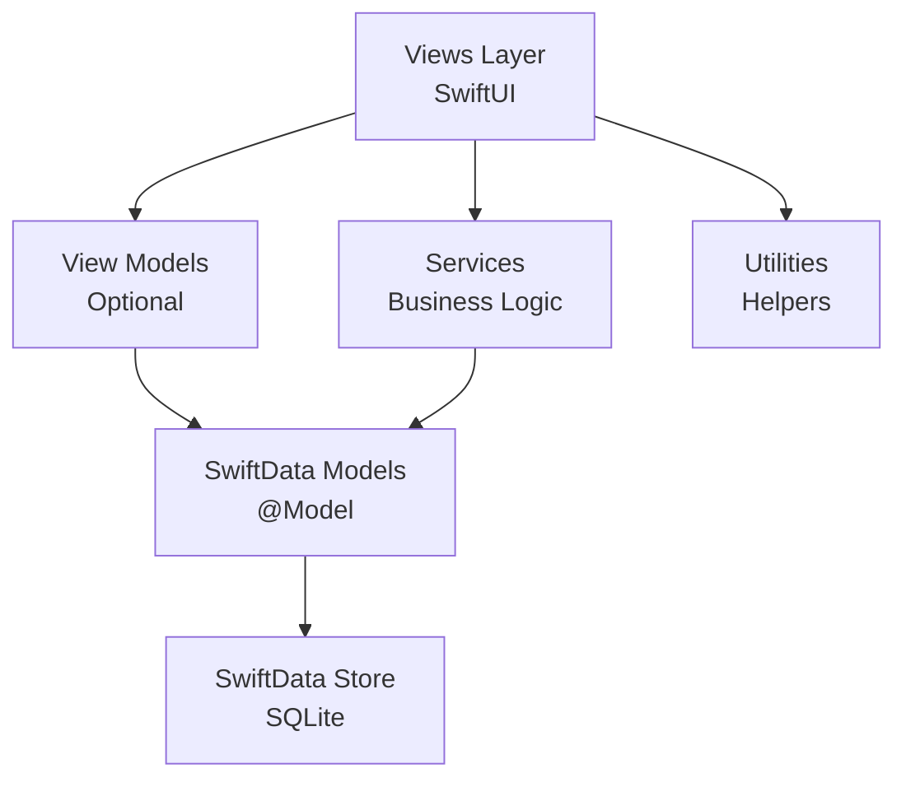

# 💪 WorkoutTracker

<div align="center">


**A comprehensive fitness tracking app built with SwiftUI and SwiftData**

[Features](#-features) • [Installation](#-installation) • [Usage](#-usage) • [Architecture](#-architecture) • [Contributing](#-contributing)

</div>

---

## 📱 Overview

WorkoutTracker is a modern, privacy-first iOS fitness application that helps you track workouts, set goals, analyze progress, and maintain a fitness journal—all without leaving your device.

### ✨ What Makes It Special

- 🔒 **100% Privacy-Focused** - All data stays on your device
- 📊 **Rich Analytics** - Beautiful charts powered by Swift Charts
- 🎯 **Smart Goals** - Flexible cadences (daily, weekly, monthly, yearly)
- 💾 **SwiftData Powered** - Modern, efficient data persistence
- 🎨 **Native SwiftUI** - Smooth, native iOS experience
- 🌍 **Unit Flexibility** - Support for both metric and imperial units

---

## 🚀 Features

<table>
<tr>
<td width="50%">

### 🏋️ Workout Tracking
- **Strength Training** - Log sets, reps, and weight with ease
- **Cardio Sessions** - Track time and distance for any cardio activity
- **Custom Exercises** - Build your personal exercise library
- **Custom Trackables** - Monitor anything (water, sleep, steps, etc.)
- **Quick Navigation** - Swipe between days effortlessly
- **Daily Summaries** - See your daily progress at a glance

</td>
<td width="50%">

### 🏆 Personal Records
- **Automatic PR Detection** - Never miss a new personal best
- **Best Set Tracking** - Track your heaviest/longest single efforts
- **Best Day Volume** - Monitor your most productive training days
- **Historical Records** - View your entire PR history
- **Per-Exercise PRs** - Separate records for each exercise

</td>
</tr>
<tr>
<td width="50%">

### 🎯 Goal Management
- **Multiple Goal Types**
  - 💪 Strength goals (e.g., "Bench 225 lbs")
  - 🏃 Cardio goals (e.g., "Run 5 miles")
  - 📈 Custom trackable goals
  - ⚖️ Weight goals
- **Flexible Cadences**
  - One-time targets
  - Daily, weekly, monthly, yearly tracking
- **Visual Progress** - Clear progress bars and percentages
- **Deadline Support** - Set target dates for accountability

</td>
<td width="50%">

### 📊 Analytics & Charts
- **Exercise Analysis**
  - Volume over time (sets × reps × weight)
  - Rep distribution breakdowns
  - Weight progression tracking
- **Time Ranges** - Week, month, 3 months, year, all time
- **Body Weight Tracking** - Log and visualize weight trends
- **Cardio Analysis** - Distance and duration charts
- **Interactive Charts** - Built with Swift Charts framework

</td>
</tr>
<tr>
<td width="50%">

### 📖 Journal
- **Daily Entries** - Document your fitness journey
- **Photo Support** - Attach progress photos
- **Workout Integration** - See workouts alongside notes
- **Swipe Navigation** - Quick day-to-day browsing
- **Private Storage** - Photos stored locally in app sandbox

</td>
<td width="50%">

### ⚙️ Customization
- **Unit Preferences**
  - 🇺🇸 Imperial (lbs, miles)
  - 🌍 Metric (kg, kilometers)
- **Exercise Categories** - Organize by muscle groups
- **Trackable Templates** - Pre-built common metrics
- **Custom Exercises** - Build your own exercise library

</td>
</tr>
</table>

---

## 🛠 Technology Stack

<table>
<tr>
<td align="center" width="20%">
<br>
<strong>SwiftUI</strong><br>
<sub>Modern UI Framework</sub>
</td>
<td align="center" width="20%">
<br>
<strong>Swift 5.9+</strong><br>
<sub>Programming Language</sub>
</td>
<td align="center" width="20%">
<br>
<strong>SwiftData</strong><br>
<sub>Data Persistence</sub>
</td>
<td align="center" width="20%">
<br>
<strong>Swift Charts</strong><br>
<sub>Data Visualization</sub>
</td>
<td align="center" width="20%">
<br>
<strong>Xcode 15+</strong><br>
<sub>Development</sub>
</td>
</tr>
</table>

**Architecture:** MVVM with SwiftData
**Minimum iOS:** 17.0
**Dependencies:** None (Pure SwiftUI + Apple frameworks)

---

## 📂 Project Structure

```
WorkoutTracker/
├── 📊 Models/                    # SwiftData Models
│   ├── Exercise.swift           # Exercise definitions
│   ├── StrengthSet.swift        # Strength workout logs
│   ├── CardioSession.swift      # Cardio workout logs
│   ├── Goal.swift               # User goals & targets
│   ├── JournalEntry.swift       # Daily journal entries
│   ├── WeightEntry.swift        # Body weight tracking
│   ├── TrackableItem.swift      # Custom metric definitions
│   └── TrackableLog.swift       # Custom metric logs
│
├── 🎨 Views/                     # SwiftUI Views
│   ├── Track/                   # 🏋️ Workout tracking screens
│   │   ├── TrackView.swift
│   │   ├── AddSetSheet.swift
│   │   ├── AddCardioSheet.swift
│   │   └── LogTrackableEntrySheet.swift
│   ├── PRs/                     # 🏆 Personal records
│   │   └── PRsView.swift
│   ├── Goals/                   # 🎯 Goal management
│   │   ├── GoalsView.swift
│   │   └── GoalEditorView.swift
│   ├── Analyze/                 # 📊 Analytics & charts
│   │   ├── AnalyzeView.swift
│   │   ├── ExerciseAnalyzeSection.swift
│   │   └── WeightAnalyzeSection.swift
│   ├── Journal/                 # 📖 Daily journal
│   │   └── JournalView.swift
│   ├── Settings/                # ⚙️ App settings
│   │   ├── SettingsView.swift
│   │   └── TrackableCatalogView.swift
│   ├── Shared/                  # 🔄 Reusable components
│   │   ├── SummaryCard.swift
│   │   └── TrackFilterSheet.swift
│   └── RootTabView.swift        # 🧭 Main navigation
│
├── ⚙️ Services/                  # Business Logic
│   ├── ImageStore.swift         # Photo persistence
│   └── GoalProgressService.swift # Goal calculations
│
├── 🔧 Utilities/                 # Helper Functions
│   ├── Date+Only.swift          # Date utilities
│   ├── Formatters.swift         # Number/date formatting
│   ├── Units.swift              # Unit conversions
│   ├── TrackableCatalog.swift   # Predefined trackables
│   ├── MuscleGroups.swift       # Exercise categories
│   └── AppLogger.swift          # Logging utilities
│
└── 🎨 Assets.xcassets/           # Images & Colors
```

---

## 📥 Installation

### Prerequisites

| Requirement | Version |
|------------|---------|
| macOS | 13.0+ (Ventura or later) |
| Xcode | 15.0+ |
| iOS Device/Simulator | 17.0+ |

### Quick Start

```bash
# 1. Clone the repository
git clone https://github.com/Unclip1843/ios-worktout-tracker.git
cd ios-worktout-tracker

# 2. Open in Xcode
open WorkoutTracker.xcodeproj

# 3. Select your target device (iOS 17.0+)
# 4. Press ⌘R to build and run
```

### First Launch

On first run, the app will:
- ✅ Initialize the SwiftData store
- ✅ Create default exercise templates
- ✅ Set up unit preferences (customizable in Settings)

**No additional setup required!** 🎉

---

## 📖 Usage

### Quick Start Guide

<details>
<summary><strong>🏋️ Tracking a Workout</strong></summary>

1. Open the **Track** tab
2. Tap the **+ Add** button
3. Select workout type:
   - **Strength** - Enter exercise, sets, reps, weight
   - **Cardio** - Enter activity, time, distance
   - **Custom** - Log any custom trackable
4. Tap **Save** to record

**Tip:** Swipe left/right to navigate between days!

</details>

<details>
<summary><strong>🎯 Creating a Goal</strong></summary>

1. Navigate to **Goals** tab
2. Tap **+ New Goal**
3. Configure:
   - **Type:** Strength, cardio, trackable, or weight
   - **Target:** Enter your goal value
   - **Cadence:** Choose frequency (daily, weekly, etc.)
   - **Deadline:** (Optional) Set a target date
4. Tap **Create**

Progress updates automatically as you log workouts!

</details>

<details>
<summary><strong>📊 Viewing Analytics</strong></summary>

1. Go to **Analyze** tab
2. Select an exercise or metric from the list
3. Choose a time range:
   - Week, Month, 3 Months, Year, All Time
4. View charts:
   - Volume progression
   - Rep distribution
   - Weight trends
   - Personal records

</details>

<details>
<summary><strong>📖 Journal Entries</strong></summary>

1. Open **Journal** tab
2. Tap on any day to add/edit an entry
3. Write your notes
4. Tap 📷 to attach photos
5. Swipe left/right to browse other days

Photos are stored securely in the app's document directory.

</details>

<details>
<summary><strong>⚙️ Changing Units</strong></summary>

1. Go to **Settings** tab
2. Toggle unit preferences:
   - **Weight:** Pounds ↔ Kilograms
   - **Distance:** Miles ↔ Kilometers

All existing data will be converted automatically!

</details>

---

## 🏗 Architecture

### High-Level Architecture



### Key Design Decisions

| Decision | Rationale |
|----------|-----------|
| **SwiftData** | Modern, type-safe persistence with minimal boilerplate |
| **Custom Tab Bar** | Support 5 visible tabs without "More" overflow |
| **MVVM Pattern** | Clear separation of concerns, testable code |
| **Metric Storage** | Internal consistency, display conversion on-demand |
| **Local-First** | Privacy-focused, no cloud dependency |

### Data Flow

```
User Input → View → ModelContext → SwiftData → Persistence
                ↓                        ↓
            @State               @Query (auto-updates)
                ↓                        ↓
           UI Update ← View ← SwiftData Store
```

**For detailed architecture documentation, see [ARCHITECTURE.md](ARCHITECTURE.md)**

---

## 💾 Data Storage

| Data Type | Storage Method | Location |
|-----------|---------------|----------|
| Workouts, Goals, Exercises | SwiftData | SQLite database |
| Journal Photos | FileManager | App Documents directory |
| User Preferences | UserDefaults | App preferences |

**Privacy First:** All data stays on your device. No cloud sync, no analytics, no tracking.

---

## 🔑 Key Features in Detail

### Custom Tab Bar Implementation

iOS's native `TabView` only supports 5 tabs before adding a "More" menu. WorkoutTracker implements a **custom tab bar** using `VStack` + `HStack` to ensure all 5 tabs remain visible and accessible.

**Benefits:**
- ✅ All tabs always visible
- ✅ Custom animations and styling
- ✅ No "More" overflow menu
- ✅ Consistent user experience

### Smart Unit Conversion

All measurements are stored in **metric** (kg, km) internally and converted for display based on user preferences. This ensures:
- Data consistency across unit changes
- Accurate historical data
- No data migration needed when switching units

### Intelligent Goal Calculations

Goals automatically aggregate data based on their cadence:

| Cadence | Calculation Method |
|---------|-------------------|
| **One-time** | Cumulative sum since creation |
| **Daily** | Sum of today's values |
| **Weekly** | Sum of current week (Mon-Sun) |
| **Monthly** | Sum of current month |
| **Yearly** | Sum of current year |

### Automatic PR Detection

Personal records are detected and updated automatically:
- **Single Set PRs:** Best weight × reps for each exercise
- **Daily Volume PRs:** Highest total volume in a single day
- **Distance PRs:** Longest single cardio session

---

## 🤝 Contributing

We welcome contributions! See our [CONTRIBUTING.md](CONTRIBUTING.md) for:
- Development setup
- Code style guidelines
- Testing strategies
- Pull request process

### Quick Contribution Guide

```bash
# 1. Fork the repository
# 2. Create a feature branch
git checkout -b feature/amazing-feature

# 3. Make your changes
# 4. Commit with conventional commits
git commit -m "feat(goals): add quarterly cadence option"

# 5. Push and create a pull request
git push origin feature/amazing-feature
```

---

## 📜 License

This project is available for personal and educational use.

---

## 🙏 Acknowledgments

Built with ❤️ using:
- [SwiftUI](https://developer.apple.com/xcode/swiftui/)
- [SwiftData](https://developer.apple.com/xcode/swiftdata/)
- [Swift Charts](https://developer.apple.com/documentation/charts)

---

## 📞 Support & Feedback

- 🐛 [Report a Bug](https://github.com/Unclip1843/ios-worktout-tracker/issues)
- 💡 [Request a Feature](https://github.com/Unclip1843/ios-worktout-tracker/issues)
- 📖 [Read the Docs](ARCHITECTURE.md)

---

<div align="center">

**⭐ Star this repo if you find it useful!**

Made with 💪 and Swift

</div>
