# 🔄 User Flows

Complete user journey diagrams for WorkoutTracker's core features.

---

## Table of Contents

- [First Time User Journey](#first-time-user-journey)
- [Track Workout Flow](#track-workout-flow)
- [Create Goal Flow](#create-goal-flow)
- [View Analytics Flow](#view-analytics-flow)
- [Journal Entry Flow](#journal-entry-flow)
- [Settings & Customization](#settings--customization)

---

## First Time User Journey


**Key Moments:**
1. **Instant Start** - No signup, no onboarding screens
2. **Smart Defaults** - Pre-populated exercises (Bench Press, Squats, etc.)
3. **Guided Discovery** - Empty states guide user to first action

---

## Track Workout Flow

### Flow Diagram


### Step-by-Step: Strength Workout

| Step | Screen | Action | Result |
|------|--------|--------|--------|
| 1 | Track Tab | User lands on main screen | Sees today's workouts + Add button |
| 2 | Track Tab | Taps "+" button | Modal sheet appears |
| 3 | Add Modal | Selects "Strength" | Opens Add Set sheet |
| 4 | Add Set Sheet | Picks "Bench Press" from list | Exercise selected |
| 5 | Add Set Sheet | Enters reps: 10 | Number validated |
| 6 | Add Set Sheet | Enters weight: 135 lbs | Converted to 61.2 kg internally |
| 7 | Add Set Sheet | Taps "Save" | Sheet dismisses |
| 8 | Track Tab | Set appears in list | Volume calculated, PR checked |
| 9 | Track Tab (if PR) | 🏆 Badge appears | User gets instant feedback |

### Error Handling


---

## Create Goal Flow

### Flow Diagram


### Goal Progress Calculation

```mermaid
graph LR
    A[Goal Created] --> B{Cadence Type}

    B -->|One-time| C[Sum ALL entries<br/>since creation]
    B -->|Daily| D[Sum TODAY's entries]
    B -->|Weekly| E[Sum THIS WEEK's entries<br/>Mon-Sun]
    B -->|Monthly| F[Sum THIS MONTH's entries]
    B -->|Yearly| G[Sum THIS YEAR's entries]

    C --> H[Calculate Percentage]
    D --> H
    E --> H
    F --> H
    G --> H

    H --> I[Current ÷ Target × 100]
    I --> J[Update Progress Bar]
    J --> K{Reached Target?}
    K -->|Yes| L[🎉 Mark Complete]
    K -->|No| M[Show Progress %]

    style L fill:#7ED321
    style M fill:#F5A623
```



---

## View Analytics Flow

### Flow Diagram


### Chart Generation Process


---

## Journal Entry Flow

### Flow Diagram



```mermaid
graph TD
    A[Journal Tab] --> B[Calendar View]
    B --> C[Select Date]

    C --> D{Entry Exists?}
    D -->|No| E[Show Empty State]
    D -->|Yes| F[Load Entry]

    E --> G[Tap to Add Entry]
    F --> H[Show Entry Content]

    G --> I[Entry Editor]
    H --> I

    I --> J[Write Text]
    J --> K{Add Photos?}
    K -->|Yes| L[Tap Photo Button]
    K -->|No| M[Tap Save]

    L --> N[Photo Picker Opens]
    N --> O[Select Photos]
    O --> P[Compress & Resize]
    P --> Q[ImageStore.save]
    Q --> R[Store UUIDs in Entry]
    R --> M

    M --> S[Save to SwiftData]
    S --> T[✅ Entry Saved]
    T --> U[Back to Calendar]

    U --> V[Swipe Left/Right]
    V --> W[Navigate Days]
    W --> B

    style T fill:#7ED321
```

### Photo Management


---

## Settings & Customization

### Flow Diagram


---

## Decision Trees

### What Should I Track?


### When to Create a Goal?


---

## Navigation Patterns

### Tab Navigation Flow


### Deep Linking Patterns

```
Track Workout → PR Detected → Tap Badge → Navigate to PRs Tab
Goal Progress → Tap Goal → Shows Contributing Workouts → Tap Workout → Navigate to Track Tab
Chart View → Tap Data Point → Shows Sets for That Day → Navigate to Track Tab (That Date)
Journal → View Photos → Tap Photo → Full Screen View → Swipe Gallery
```

---

## Error States & Edge Cases

### No Data States


### Network/Storage Errors


---

## Performance Optimizations

### Data Loading Strategy


---

## Accessibility Flows

### VoiceOver Navigation

```
Track Tab:
"Track. Tab 1 of 5. Selected."
"Add workout button. Double-tap to add a new workout."
"Today's Workouts. Heading."
"Bench Press. 3 sets. Total volume 3,150 pounds."
```

### Dynamic Type Support


---

## Key Takeaways

1. **Zero Friction** - No signup, instant tracking
2. **Smart Defaults** - Pre-populated exercises, intuitive units
3. **Instant Feedback** - PR detection, progress updates
4. **Flexible Goals** - Multiple cadences for any fitness objective
5. **Privacy First** - All data local, no network calls

---

**For implementation details, see [ARCHITECTURE.md](../ARCHITECTURE.md)**
**For contributing, see [CONTRIBUTING.md](../CONTRIBUTING.md)**
